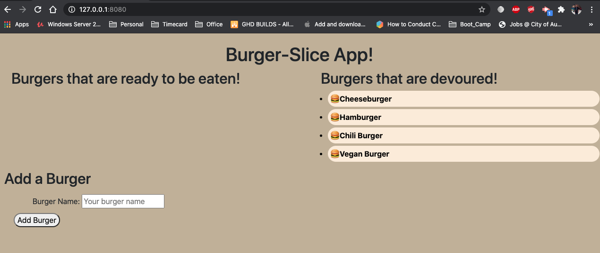

# Burger-Slice

# Table of Contents  

* [Discription](#discription)
* [Screenshot](#screenshot)   
* [Contacts](#contacts)
* [Programming-Language](#programming-language)

## Discription   

This is a node application that allow users to create burgers they will like to eat. User will be able to add as many as burgers they want and it will be stored in MySQL database. Users will be able to selecte if the burger is devoured or ready to be eaten and the data will persist.

## Screenshot

[Click here for the video link](https://drive.google.com/file/d/1HxemWznTZB_291NVgpjunY036jH3Y8PG/view?usp=sharing)

[Click here for my Portfolio](https://protected-fortress-39623.herokuapp.com/)

 
## Contacts Info

Please reach out to me if you have any questions.

Email: afam262@gmail.com

Github Username: Afam-26

[Github link](https://github.com/Afam-26/Burger-Slice.git) 

## Programming-Language 
\`\`\`

    Node

    Inquirer 

    MySQL 

    Handlebars

    homemade ORM
\`\`\`